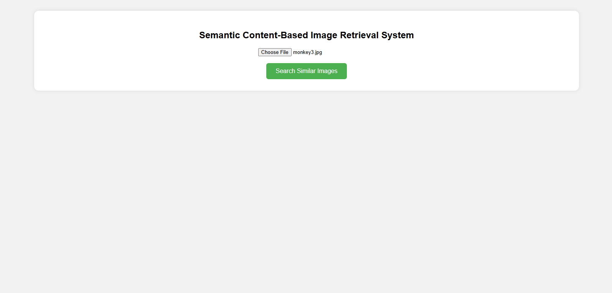

# Semantic Content-Based Image Retrieval System using CLIP Vision-Language Model

## 📌 Project Overview

This project implements a **Semantic Content-Based Image Retrieval (CBIR) System** that retrieves images based on their **semantic meaning** rather than low-level visual similarity. The system allows a user to upload an image through a web interface, understands the conceptual content of the image using a modern AI model, and returns semantically similar images from a database.

Unlike traditional CBIR systems that rely on color, texture, and shape features, this system uses **CLIP (Contrastive Language–Image Pretraining)**, a vision-language model developed by OpenAI, to perform **meaning-based image retrieval**.

---

## 🎯 Key Features

* Upload-based image search
* Semantic (meaning-based) image retrieval
* Uses CLIP Vision-Language Model
* Cosine similarity–based ranking
* Web-based interface using Flask
* No manual labels or metadata required
* Robust and production-safe path handling

---

## 📸 Demo Screenshots

### Home Page


### Search Results


### terminal 1


### terminal 2


## 🧠 Technology Stack

| Component               | Technology        |
| ----------------------- | ----------------- |
| Programming Language    | Python            |
| AI Model                | CLIP (ViT-B/32)   |
| Deep Learning Framework | PyTorch           |
| Web Framework           | Flask             |
| Image Processing        | PIL               |
| Similarity Measure      | Cosine Similarity |
| Frontend                | HTML, CSS         |

---

## 🏗 System Architecture

```
User Upload Image
        ↓
Image Preprocessing
        ↓
CLIP Semantic Encoder
        ↓
Semantic Feature Embedding
        ↓
Cosine Similarity Matching
        ↓
Ranking Engine
        ↓
Similar Image Results
```

---

## 📂 Project Structure

```
Semantic-CBIR-System/
├── Semantic_CBIR_CLIP_Full_Fixed_System.py
├── all_images/
│   └── sample images
├── uploads/
├── README.md
```

> ⚠️ Only sample images are included in this repository. Full datasets are intentionally excluded.

---

## 🚀 How to Run the Project

### 1️⃣ Install Dependencies

```bash
pip install flask torch torchvision pillow git+https://github.com/openai/CLIP.git
```

### 2️⃣ Run the Application

```bash
python Semantic_CBIR_CLIP_Full_Fixed_System.py
```

### 3️⃣ Open in Browser

```
http://127.0.0.1:5000
```

---

## 🖼 How It Works

1. User uploads an image through the web interface
2. The image is processed by the CLIP model
3. Semantic embeddings are generated
4. The query embedding is compared with database embeddings
5. Cosine similarity scores are computed
6. Images are ranked based on semantic similarity
7. Top-K similar images are displayed

---

## 🔬 Why CLIP?

Traditional CBIR systems retrieve images based on surface-level visual features, which often leads to visually similar but semantically irrelevant results. CLIP bridges the **semantic gap** by learning joint image–text representations, enabling concept-aware image retrieval.

Example:

* Monkey → Monkey images
* Dog → Dog images
* Car → Vehicle images

---

## 📊 Applications

* Smart image search engines
* Medical image retrieval
* Wildlife identification
* E-commerce product search
* Digital libraries
* Surveillance systems
* AI-based photo management

---

## ✅ Advantages

* Meaning-based retrieval
* No manual labeling required
* High retrieval accuracy
* Scalable and modern AI approach
* User-friendly interface

---

## ⚠️ Limitations

* Requires high computational resources
* Slower on CPU-only systems
* Performance depends on dataset quality

---

## 🔮 Future Enhancements

* Hybrid CBIR (visual + semantic)
* Text-to-image search
* Large-scale indexing using FAISS
* Cloud deployment
* REST API support
* Mobile application

---

## 🎓 Academic Use

This project is suitable for:

* Final year projects
* Research demonstrations
* AI/ML portfolios
* Internship and placement showcases

---

## 👨‍💻 Author

**Amit**
CSE (Artificial Intelligence)

---

## 📜 License

This project is intended for academic and educational purposes.
